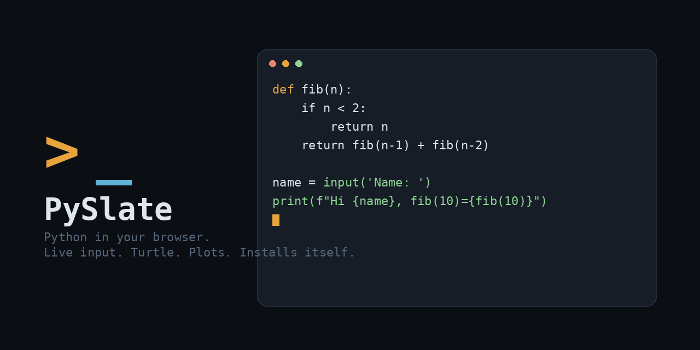

<p align="center">
  
</p>

<h1 align="center">PySlate</h1>
<p align="center">A Python IDE that runs entirely in your browser — no server, no install, no account.</p>

<p align="center">
  <a href="#install">Install</a> ·
  <a href="#features">Features</a> ·
  <a href="#architecture">Architecture</a> ·
  <a href="#deploy-your-own">Deploy your own</a> ·
  <a href="#license">License</a>
</p>

---

## Install

PySlate is a Progressive Web App — it installs like a native app, straight from the browser, with no app store.

1. Open **[your deployed link here]** on your phone or laptop.
2. **Android (Chrome):** tap the menu (⋮) → **Install app** (or use the install banner if it appears).
   **iPhone (Safari):** tap Share → **Add to Home Screen**.
   **Desktop (Chrome/Edge):** click the install icon in the address bar.
3. It now opens full-screen from your home screen / app list, like any other app.

**Updates are automatic.** Whenever this repo gets updated and redeployed, the app fetches the newest version the next time you open it — no reinstalling, no uninstalling, nothing to do. See [Architecture](#architecture) for how that works.

## Features

- **Live, pausing `input()`** — when your script asks for input, execution genuinely pauses and prompts you right in the terminal, like a real console
- **Syntax-highlighted editor** with a mobile-friendly symbol keyboard (`: ( ) [ ] { } " '` and common snippets) and Python-aware auto-indent
- **Beginner-friendly errors** — tracebacks are trimmed to your own code (no interpreter internals) with a plain-English tip for common mistakes
- **`turtle` support** — real `turtle` can't run in a browser (it needs a GUI window), so PySlate ships a compatible from-scratch implementation that draws on a live canvas
- **Auto-installing libraries** — `numpy`, `pandas`, `matplotlib`, `sympy`, and anything else with a PyPI wheel installs itself the first time you import it
- **matplotlib plots** render inline as images
- **Save / reopen projects**, open a `.py` file from your device, download your script, auto-formatting, draft autosave

<!--
  Demo GIFs — record these from the live app and drop them in a /docs or /assets
  folder, then swap the placeholders below. Suggested captures:
    1. Typing input() and the live prompt pausing execution
    2. Typing code and watching CodeMirror's syntax highlighting / auto-indent
    3. A short turtle.py script drawing on the canvas
-->
<p align="center">
  
  
  
</p>

## Architecture

Everything runs client-side. There is no backend — the "server" is just static files.

| Piece | How it works |
|---|---|
| **Python runtime** | [Pyodide](https://pyodide.org) (CPython compiled to WebAssembly) runs inside a **Web Worker**, so a runaway script can't freeze the page — Stop just terminates the worker. |
| **Live `input()`** | A `SharedArrayBuffer` + `Atomics.wait()` genuinely pauses the worker thread when Python calls `input()`. The main thread shows an inline prompt, writes the answer into the shared buffer, and `Atomics.notify()` wakes the worker back up. Requires cross-origin isolation (see below). |
| **Cross-origin isolation** | `SharedArrayBuffer` needs `Cross-Origin-Opener-Policy` / `Cross-Origin-Embedder-Policy` response headers. Netlify sets these via `_headers`. GitHub Pages can't set custom headers at all, so `service-worker.js` injects them on every same-origin response instead (the standard "coi-serviceworker" technique), and the page reloads once after the worker takes control. |
| **Auto-installing packages** | Before running, the app regex-scans your `import` statements, diffs them against `sys.stdlib_module_names`, and installs anything missing via `micropip` (Pyodide's package manager) — covers any pure-Python or Pyodide-built PyPI package. |
| **`turtle`** | Not available in Pyodide at all (needs a native GUI). PySlate implements a compatible `Turtle`/`Screen` API in Python; each draw call fires a `postMessage` to the main thread, which renders it on an HTML `<canvas>` in real time. |
| **matplotlib** | Backend is forced to `Agg` (non-interactive) before your code runs. After execution, any open figures are saved to PNG, base64-encoded, and displayed inline in the output panel. |
| **Errors** | Runtime exceptions are caught in Python, the traceback is filtered down to frames from your own script (repeated frames from infinite recursion are collapsed), and a plain-English tip is appended for common exception types. |
| **Offline / auto-update** | `service-worker.js` uses a network-first strategy for the app shell — every open fetches the latest deployed version first, falling back to a cached copy only if there's no connection. That's the whole update mechanism: push new code, users get it next time they open the app. |
| **Persistence** | Projects and the current draft are stored in `localStorage`, scoped to the device/browser. Nothing leaves the browser except package downloads and CDN assets. |

## Deploy your own

Everything is static files — any static host works. Two are documented here.

### Run locally

```bash
git clone https://github.com/<you>/<repo>.git
cd <repo>
python3 -m http.server 8000
# open http://localhost:8000
```
Note: `localhost` is treated as a secure context, so live input works locally too, even without the service worker's header polyfill kicking in yet.

### GitHub Pages (free, public)

1. Push this repo to GitHub.
2. **Settings → Pages → Source** → select your branch and `/ (root)` → **Save**.
3. Wait a minute or two for the first build, then open `https://<you>.github.io/<repo>/`.
4. **Updating:** just push to the same branch. GitHub Pages rebuilds automatically, and installed apps pick it up next time they're opened — see [Architecture](#architecture).

### Netlify (free, alternative)

Drag the whole folder onto [app.netlify.com/drop](https://app.netlify.com/drop), or connect the repo for git-based deploys. Netlify honors `_headers` natively, so live input works immediately without the service worker's one-time reload.

Both hosts are entirely free for a project this size — no paid tier needed.

## Browser support

Requires a modern Chromium or Firefox browser (Safari works for most features; the live `SharedArrayBuffer`-based `input()` prompt needs full cross-origin isolation support, which lags behind on some older Safari versions — those fall back to entering input values ahead of time in the Input panel instead).

## License

MIT — see [LICENSE](LICENSE). Do whatever you want with it.
